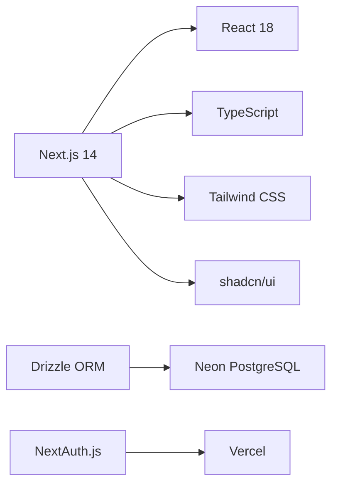

```markdown
# 🧵 PDM Pro Moda - Sistema de Gestão de Desenvolvimento Têxtil

[](https://nextjs.org/)
[](https://www.typescriptlang.org/)
[](https://tailwindcss.com/)
[](https://orm.drizzle.team/)
[](https://neon.tech/)
[](https://vercel.com/)
[](LICENSE)

## 📋 Sobre o Projeto

O **PDM Pro Moda** é um sistema completo de gestão de desenvolvimento de produtos têxteis, projetado para conectar os departamentos **Comercial**, **Desenvolvimento (Tecelagem e Beneficiamento)** e **PCP**, eliminando retrabalhos e garantindo rastreabilidade completa das solicitações.

### 🎯 Problemas que Resolve

| Problema | Solução |
|----------|---------|
| 📧 Comunicação via email/WhatsApp perdida | Centralização de todas solicitações |
| 📊 Fichas técnicas em Excel com versões conflitantes | Controle de versão e histórico de aprovações |
| 🔄 PCP recebe informações incompletas | Ficha técnica completa antes da produção |
| 🏷️ Produtos fora do padrão Systêxtil | Pré-cadastros alinhados ao ERP |
| ❓ Briefing comercial insuficiente | 8 seções estruturadas de briefing |

## ✨ Funcionalidades

### 🚀 MVP (Fase 1)
- ✅ Criar solicitação de desenvolvimento com briefing completo
- ✅ Anexar arquivos (PDF, DOCX, XLSX, JPG, PNG, MP4)
- ✅ Adicionar links (YouTube, Google Sheets, Google Docs, Google Agenda)
- ✅ Listagem de solicitações com filtros
- ✅ Acompanhamento de status
- ✅ Histórico de comunicação

### 🔧 Pós-MVP (Fase 2-5)
- 🧵 Cadastro de Fios (Nível 7)
- 📦 Cadastro de Bases de Urdume (Nível 4)
- 🏭 Cadastro de Produtos Cru (Nível 2)
- 🎨 Cadastro de Cores e Estampas
- 🧪 Produtos Beneficiados (Tingidos/Estampados/Termofixados)
- 📝 Receitas de Tinturaria, Estamparia e Termofixação
- ⚙️ Roteiros de Produção com máquinas
- 📦 Solicitação de Amostra e Produção

## 🛠️ Stack Tecnológica



| Camada | Tecnologia | Versão |
|--------|------------|--------|
| **Frontend/Backend** | Next.js (App Router) | 14.2 |
| **Linguagem** | TypeScript | 5.3 |
| **UI** | React + Tailwind + shadcn/ui | 18.2 |
| **ORM** | Drizzle ORM | 0.29 |
| **Database** | PostgreSQL (Neon) | Latest |
| **Auth** | NextAuth.js | 4.24 |
| **Storage** | Vercel Blob | Latest |
| **Hospedagem** | Vercel | - |

## 🏗️ Estrutura do Projeto

```
pdmtextil/
├── src/
│   ├── app/
│   │   ├── (auth)/           # Autenticação
│   │   ├── (dashboard)/      # Área logada
│   │   │   ├── comercial/    # Módulo Comercial
│   │   │   ├── tecelagem/    # Módulo Tecelagem
│   │   │   ├── beneficiamento/ # Módulo Beneficiamento
│   │   │   ├── pcp/          # Módulo PCP
│   │   │   └── cadastros/    # Cadastros base
│   │   └── api/              # API Routes
│   ├── components/           # Componentes reutilizáveis
│   ├── lib/                  # Utilitários e configurações
│   ├── hooks/                # Hooks customizados
│   └── types/                # Definições TypeScript
├── drizzle.config.ts
├── next.config.js
└── package.json
```

## 🚀 Instalação e Uso

### Pré-requisitos

- Node.js 18+
- PostgreSQL (Neon recomendado)
- Conta Vercel (para deploy)

### Configuração Local

```bash
# Clone o repositório
git clone https://github.com/seu-usuario/pdmtextil.git
cd pdmtextil

# Instale as dependências
npm install

# Configure as variáveis de ambiente
cp .env.example .env.local

# Execute as migrations
npm run db:migrate

# Popule o banco com dados iniciais
npm run db:seed

# Inicie o servidor de desenvolvimento
npm run dev
```

### Variáveis de Ambiente

```env
# Database (Neon)
DATABASE_URL="postgresql://..."

# Next Auth
NEXTAUTH_URL="http://localhost:3000"
NEXTAUTH_SECRET="seu-secret"

# Vercel Blob
BLOB_READ_WRITE_TOKEN="vercel_blob_token"

# Resend (Emails)
RESEND_API_KEY="re_api_key"
```

## 🔐 Usuários de Teste (Seed)

| Email | Senha | Perfil |
|-------|-------|--------|
| comercial@promoda.com | 123456 | COMERCIAL |
| tecelagem@promoda.com | 123456 | TECELAGEM |
| beneficiamento@promoda.com | 123456 | BENEFICIAMENTO |
| pcp@promoda.com | 123456 | PCP |
| admin@promoda.com | 123456 | ADMIN |

## 📚 Documentação

A documentação completa do sistema está disponível em:
- [Documentação Técnica](./docs/DOCUMENTACAO_COMPLETA.md)
- [Design de Telas](./docs/DESIGN_TELAS.md)

## 🤝 Contribuições

Contribuições são bem-vindas! Sinta-se à vontade para abrir issues ou pull requests.

1. Faça um fork do projeto
2. Crie sua branch (`git checkout -b feature/nova-feature`)
3. Commit suas mudanças (`git commit -m 'feat: adiciona nova feature'`)
4. Push para branch (`git push origin feature/nova-feature`)
5. Abra um Pull Request

## 📄 Licença

Distribuído sob a licença MIT. Veja `LICENSE` para mais informações.

## 👏 Créditos

Desenvolvido com ❤️ por **Pro Moda Têxtil**

### 🧠 Inspiração e Base Técnica

Este projeto foi construído sobre os alicerces do **[Apontador](https://github.com/devtiagoabreu/apontador)** - Sistema de Apontamento Têxtil (MES), criado por:

### 👨‍💻 **Tiago de Abreu** | [](https://github.com/devtiagoabreu) [](https://linkedin.com/in/devtiagoabreu) [](https://twitter.com/devtiagoabreu) [](https://tiagoabreu.dev)

```
🚀 Especialista em Next.js | 🏭 Indústria 4.0 Têxtil | ☁️ Serverless
```

> *"O Apontador provou que é possível integrar Next.js com Systêxtil no chão de fábrica. O PDM Pro Moda é a continuação natural dessa jornada, resolvendo agora o início do processo - do briefing à aprovação."*

### 🎨 Stack Base (inspirada no Apontador)

| Tecnologia | Uso no PDM Pro Moda |
|------------|---------------------|
| Next.js 14 App Router | Framework principal |
| TypeScript | Tipagem segura |
| Drizzle ORM | Schema e migrations |
| Neon PostgreSQL | Banco de dados serverless |
| shadcn/ui | Componentes UI |
| React Hook Form + Zod | Formulários e validação |
| Tailwind CSS | Estilização |

## 📧 Contato

**Pro Moda Têxtil**
- 📍 Localização: [Sua cidade, Estado]
- 📧 Email: contato@promoda.com.br
- 🌐 Website: www.promoda.com.br

---

⭐ Se este projeto foi útil para você, considere dar uma estrela no GitHub!

Desenvolvido com ☕ e 💻 para a indústria têxtil brasileira.
```

---

## 🖼️ Sugestão de Estrutura de Pastas para README

```
pdmtextil/
├── README.md                    # ← Este arquivo
├── LICENSE                      # MIT License
├── package.json
├── .env.example
├── .gitignore
├── drizzle.config.ts
├── next.config.js
├── tailwind.config.js
├── tsconfig.json
├── docs/
│   ├── DOCUMENTACAO_COMPLETA.md
│   ├── DESIGN_TELAS.md
│   └── API_REFERENCE.md
├── public/
│   ├── logo.png
│   └── favicon.ico
└── src/
    └── ...
```

---

### 📝 Notas para o README

1. **Badges**: Atualize os links dos badges conforme seu repositório real
2. **Links**: Substitua `seu-usuario` pelo nome do seu repositório no GitHub
3. **Contato**: Atualize os dados de contato da Pro Moda Têxtil
4. **Imagens**: Adicione um logo da empresa na pasta `public/`

### 📱 Redes Sociais no README

Os badges usados seguem o padrão [Shields.io](https://shields.io/):

```markdown
[](https://github.com/devtiagoabreu)
[](https://linkedin.com/in/devtiagoabreu)
[](https://twitter.com/devtiagoabreu)
[](https://tiagoabreu.dev)
```

