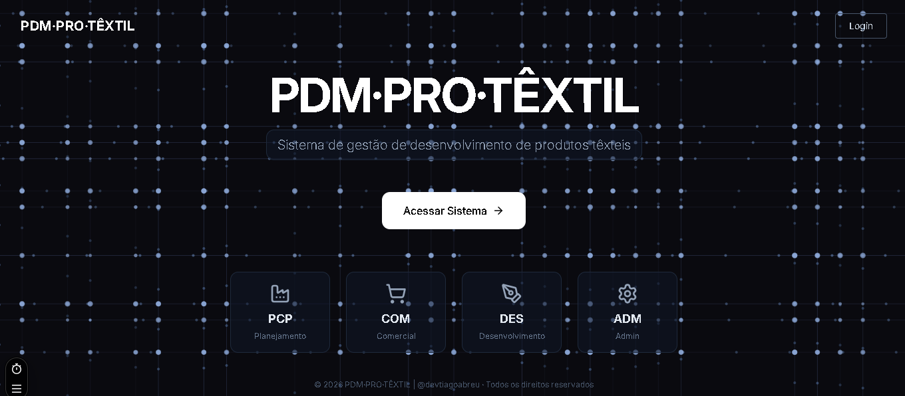

# PDM Pro Têxtil



> *⚠️ Adicione um print da landing page como `public/landing.png` para exibir aqui.*

Sistema de gestão de desenvolvimento de produtos têxteis. Conecta os departamentos **Comercial**, **Desenvolvimento (Tecelagem e Beneficiamento)** e **PCP** em uma plataforma única, eliminando retrabalhos e garantindo rastreabilidade completa.

[](https://nextjs.org/)
[](https://www.typescriptlang.org/)
[](https://tailwindcss.com/)
[](https://orm.drizzle.team/)
[](https://neon.tech/)
[](https://vercel.com/)
[](LICENSE)

---

## Funcionalidades

### Módulo Comercial
- Solicitações de desenvolvimento com briefing completo (8 seções)
- Anexos (PDF, DOCX, XLSX, JPG, PNG, MP4) via Vercel Blob
- Links integrados (YouTube, Google Sheets, Docs, Agenda)
- Histórico de comunicação por solicitação
- Cadastro de clientes com importação de API externa
- Requisições de corte com itens

### Módulo de Cadastros
- **Fios**: cadastro completo com composição, titulagem, NCM, fornecedores
- **Cores**: sólidas e de fundo com código, pantone, família
- **Estampas**: desenhos com variantes e imagens
- **Bases de Urdume**: com fios associados
- **Acabamentos**: categorizados por tipo
- **Máquinas e Operações**: cadastro técnico
- **Produtos Químicos**: com concentração, densidade, pH, FISPQ
- **Produto Cru**: ficha técnica completa com composição, estrutura, amostras e acabamentos
- **Receitas**: versionadas com itens, estágios e produtos químicos

### Romaneios de Expedição
- Consulta de romaneios via integração com ERP
- Agrupamento por lote com subtotais
- Geração de PDF em retrato ou paisagem
- Grade completa de rolos com metragem, pesos, largura e endereço

### Administração
- Gestão de usuários com perfis e permissões
- Configuração de empresa (logo, dados fiscais)
- Integrações com APIs externas (ERP, WMS)
- Notificações in-app + e-mail (SMTP)
- Logs de auditoria
- Chat corporativo por entidade

### Dashboard e Relatórios
- Gráficos de tendência mensal, distribuição por status e tipo
- Cards com indicadores: total do mês, pendentes, desenvolvimento, concluídos
- Relatórios exportáveis

---

## Stack

| Camada | Tecnologia |
|--------|------------|
| Frontend / Backend | Next.js 14 (App Router) |
| Linguagem | TypeScript 5 |
| UI | React 18 + Tailwind CSS 3.4 + shadcn/ui |
| ORM | Drizzle ORM 0.45 |
| Database | PostgreSQL (Neon Serverless) |
| Auth | NextAuth.js 4 (Credentials + JWT) |
| Storage | Vercel Blob |
| PDF | jsPDF + jspdf-autotable |
| Gráficos | Recharts |
| Formulários | React Hook Form + Zod |
| Drag & Drop | dnd-kit |
| Tabelas | TanStack Table |
| Upload | react-dropzone |
| Notificações | Sonner |
| Hospedagem | Vercel |

---

## Estrutura

```
src/
├── app/
│   ├── (dashboard)/           # Área logada
│   │   ├── admin/             # Configurações, usuários, integrações
│   │   ├── cadastros/         # Fios, cores, estampas, bases, etc.
│   │   ├── comercial/         # Solicitações, clientes, req. corte
│   │   ├── dashboard/         # Gráficos e indicadores
│   │   ├── documentos/        # Romaneios de expedição
│   │   ├── chat/              # Chat corporativo
│   │   ├── ferramentas/       # Regra de três, conversores
│   │   └── perfil/            # Perfil do usuário
│   ├── api/                   # API Routes (16 módulos)
│   ├── login/                 # Página de login
│   └── page.tsx               # Landing page
├── components/
│   ├── chat/                  # Componentes de chat
│   ├── forms/                 # Formulários reutilizáveis
│   ├── integracao/            # Modal de importação via API
│   ├── layout/                # Sidebar, header, nav
│   ├── ui/                    # shadcn/ui components
│   └── providers.tsx          # Providers (auth, theme)
├── lib/
│   ├── db/
│   │   ├── schema/            # 27 tabelas (Drizzle)
│   │   ├── migrations/        # 18 migrations SQL
│   │   └── seed.ts            # Dados iniciais
│   ├── auth.ts                # NextAuth config
│   ├── email.ts               # Nodemailer
│   ├── notificar.ts           # Notificações
│   ├── log.ts                 # Auditoria
│   ├── crypto.ts              # Criptografia AES-256-GCM
│   ├── info-content/          # Ajuda contextual
│   └── validation.ts          # Schemas Zod
├── middleware.ts               # Proteção de rotas
└── types/                      # Tipos TypeScript
```

---

## Banco de Dados (27 tabelas)

```
usuarios, sessions,
solicitacoes, anexos,
clientes, fios, fornecedores,
cores_solidas, cores_fundo,
acabamentos, maquinas, operacoes,
bases_urdume, base_urdume_fios,
estampas, produtos_cru, (composicao, estrutura, amostra, acabamento, receita),
produtos_quimicos, produto_cru_receita, produto_cru_receita_item,
integracoes, config_empresa,
email_config, email_modelos, email_listas, email_lista_contatos,
notificacoes, notificacao_regras,
logs, roles, bancos_dados,
requisicoes_corte, requisicoes_corte_itens,
chats, chat_mensagens, chat_participantes, chat_leituras,
romaneios, romaneio_pecas
```

---

## Instalação

```bash
# Pré-requisitos: Node.js 18+, PostgreSQL (Neon)

git clone https://github.com/devtiagoabreu/pdmtextil.git
cd pdmtextil
npm install

cp .env.example .env.local
# Edite .env.local com suas credenciais

npm run db:migrate
npm run dev
```

### Variáveis de Ambiente

```env
DATABASE_URL="postgresql://..."
NEXTAUTH_URL="http://localhost:3000"
NEXTAUTH_SECRET="openssl rand -base64 32"
BLOB_READ_WRITE_TOKEN="vercel_blob_token"
ENCRYPTION_KEY="chave-32-caracteres-ou-mais"
```

---

## Usuários de Teste (Seed)

| Email | Senha | Perfil |
|---|---|---|
| comercial@pdmprotextil.com.br | 123456 | COMERCIAL |
| tecelagem@pdmprotextil.com.br | 123456 | TECELAGEM |
| beneficiamento@pdmprotextil.com.br | 123456 | BENEFICIAMENTO |
| admin@pdmprotextil.com.br | 123456 | ADMIN |

---

## Scripts

| Comando | Descrição |
|---|---|
| `npm run dev` | Servidor de desenvolvimento |
| `npm run build` | Build de produção |
| `npm run start` | Iniciar produção |
| `npm run lint` | ESLint |
| `npm run db:migrate` | Criar tabelas no banco |
| `npm test` | Vitest |
| `npm run test:watch` | Vitest watch |

---

## Licença

MIT — © 2026 Tiago de Abreu

---

## Créditos

Desenvolvido por **Pro Moda Têxtil**.

Inspirado pelo sistema **[Apontador](https://github.com/devtiagoabreu/apontador)** — Sistema de Apontamento Têxtil (MES) criado por [Tiago de Abreu](https://github.com/devtiagoabreu).

[](https://github.com/devtiagoabreu)
[](https://linkedin.com/in/devtiagoabreu)
