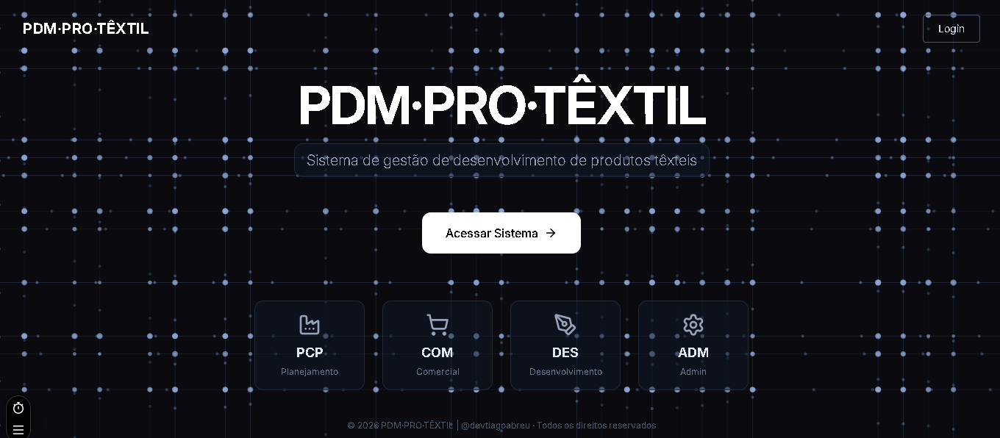

# PDM Pro Têxtil



Sistema de gestão de desenvolvimento de produtos têxteis (PDM — Product Data Management). Conecta os departamentos **Comercial**, **Desenvolvimento (Tecelagem e Beneficiamento)**, **PCP** e **CRM** em uma plataforma única, eliminando retrabalhos e garantindo rastreabilidade completa do briefing à produção — agora com **Inteligência Artificial**, **BI** e **CRM** integrados.

[](https://nextjs.org/)
[](https://www.typescriptlang.org/)
[](https://react.dev/)
[](https://tailwindcss.com/)
[](https://orm.drizzle.team/)
[](https://neon.tech/)
[](https://vercel.com/)
[](LICENSE)

---

## Funcionalidades

### Módulo Comercial
- **Solicitações de Desenvolvimento** — briefing completo dividido em 8 seções (Tecelagem e Beneficiamento), com anexos (PDF, DOCX, XLSX, JPG, PNG, MP4 via Vercel Blob) e links incorporados (YouTube, Google Sheets, Docs, Agenda)
- **Kanban de Solicitações** — arraste e solte para avançar etapas do desenvolvimento
- **Detalhe da Solicitação** — linha do tempo de status, histórico de comunicação, produtos vinculados, chat por entidade
- **Requisições de Amostra Comercial** — solicitação de amostras para clientes com kanban de acompanhamento
- **Requisições de Corte** — requisições com itens, geração de PDF
- **Clientes** — cadastro completo com importação via API externa e modelo de planilha
- **Representantes** — cadastro de representantes com vínculo a clientes e pessoas (PF/PJ), notificação de novos leads

### CRM (Comercial)
- **Leads** — captura, kanban de acompanhamento, **score com IA** (prioridade, segmento e porte classificados automaticamente)
- **Pessoas** — cadastro de pessoas físicas e jurídicas com timeline de interações, busca de CNPJ (OpenCNPJ) e integração com Google Drive
- **Oportunidades e Propostas** — funil de vendas completo com kanbans arrastáveis
- **Visitas** — planejamento (duração estimada, localização), relato de visita com templates, pesquisa de satisfação, **visitas avulsas** com vínculo posterior a cliente/pessoa
- **Tarefas e Campanhas** — organização do time comercial com kanbans e notificações
- **Equipes e Regiões** — estrutura organizacional com cidades e estados
- **IA do CRM** — classificação de leads, **previsão de vendas**, reativação de clientes e resumo automático de pessoas
- **Treinamento** — módulos e lições com trilhas de aprendizado
- **Relatórios CRM** — indicadores e exportação de dados

### Módulo BI
- **Leitura de Google Sheets** — carrega todas as abas da planilha (descoberta automática de GIDs) com os nomes reais
- **Consultas** — por produto, por grupo (clientes do grupo com data da última compra), por representante e por cliente
- **Filtro por período** — baseado na coluna `DATA_MOVTO` com data inicial/final e atalhos (mês atual, mês passado, trimestre, semestre, 12 meses)
- **Indicadores** — cards de métricas, tendência mensal, distribuição geográfica, **curva ABC**, curva de compra dos clientes e **previsões**
- **Cache em Postgres** — tabela `bi_sheets` com TTL configurável em `config_geral` (padrão 10 min)

### Inteligência Artificial
- **Chaves de IA multi-provedor** — cadastro de chaves com **fallback automático** entre provedores em caso de falha
- **Provedores suportados** — Groq (Llama), OpenAI (GPT), Anthropic (Claude), Gemini e DeepSeek (compatível com OpenAI)
- **Gestão** — ordem de prioridade, ativação/desativação, contador de falhas e teste de conexão por chave
- **Uso no sistema** — bot de WhatsApp, classificação de leads, previsão de vendas e resumo de pessoas

### WhatsApp / Evolution API
- **Bot com IA** — webhook próprio (substitui n8n) com máquina de estados, controle de abandono e fila de retry
- **Catálogo de produtos** — catálogo WhatsApp vinculado a linhas e tipos de pessoa
- **Monitoramento** — dashboard com estados das conversas e monitor com passos do fluxo
- **Notificações** — novos leads para representantes via WhatsApp (PJ e PF)

### Módulo de Amostras (Desenvolvimento)
- **Listagem de Amostras** — tabela com abas Tecido Cru / Acabamento, links diretos para ficha técnica do produto, filtros por status, geração de PDF "Solicitação de Amostra"
- **Kanban de Amostras** — arraste e solte por colunas de status configuráveis
- **Vínculo com Produto** — cada amostra pertence a um produto cru (tecido ou acabamento) com rastreabilidade completa
- **Avanço Automático** — ao mover amostra para "Em Produção" no kanban, a solicitação vinculada avança automaticamente para "Pilotagem"

### Módulo de Cadastros (Engenharia Têxtil)
- **Fios** — cadastro completo: composição, titulagem (Ne, Nm, Tex), NCM, fornecedores vinculados, importação em lote
- **Cores** — cores sólidas e de fundo com código, pantone, família de cor, importação em lote
- **Estampas** — desenhos com variantes e imagens, importação em lote
- **Bases de Urdume** — cadastro com fios associados, importação em lote
- **Fornecedores** — cadastro com importação em lote
- **Acabamentos** — categorizados por tipo (químico, mecânico, lavagem etc.)
- **Máquinas e Operações** — cadastro técnico de máquinas e operações do beneficiamento
- **Produtos Químicos** — cadastro com concentração, densidade, pH, FISPQ, importação em lote
- **Produtos (Tecidos)** — ficha técnica completa do produto cru:
  - Composição (liga de fios com percentuais)
  - Estrutura têxtil (trama, urdume, batidas, gramatura)
  - Amostras de tecido cru (com status, links, motivos, PDF)
  - Acabamentos vinculados (com receitas, amostras de acabamento)
  - Receitas de beneficiamento versionadas
- **Receitas** — receitas de beneficiamento com itens, estágios, produtos químicos, versionamento, duplicação

### Chat Corporativo
- **Chat por Entidade** — conversas vinculadas a solicitações ou produtos
- **Mensagens com @mention** — autocomplete de todos os usuários ativos, com suporte a acentos, destaque visual nas bolhas
- **Notificações** — ao mencionar alguém com `@Nome`, o usuário recebe notificação in-app e e-mail com link direto para a conversa
- **Editar / Apagar** — própria mensagem dentro da janela de 5 minutos
- **Indicador de Não Lidas** — badge no header e ícone de visualizado (duplo check)
- **Emoji Picker** — seletor de emojis integrado

### Dashboard e Indicadores
- **Dashboard Principal** — cards com totais do mês, pendentes, em desenvolvimento, pilotagem, concluídos, produtos CAD
- **Gráficos** — tendência mensal (linha), distribuição por status (barras), distribuição por tipo (pizza)
- **Atividades Recentes** — feed com últimas movimentações do sistema
- **Dashboard Amostras** — indicadores específicos de amostras de desenvolvimento
- **Dashboard Amostra Comercial** — indicadores de requisições de amostra comercial
- **Dashboard Requisições de Corte** — métricas de corte
- **Dashboard CRM** — funil, vendas e indicadores do comercial

### Relatórios (10+ tipos)
- Solicitações Criadas (período)
- Solicitações por Status
- Solicitações Concluídas
- Histórico de Solicitação (auditoria completa)
- Amostras por Status
- Amostra Comercial por Status
- Histórico de Amostra
- Tempo em Status (solicitações e amostras)
- Atividade por Usuário
- Relatórios CRM (funil, vendas, visitas, campanhas)

### Documentos
- **Romaneios de Expedição** — consulta via integração com ERP, agrupamento por lote com subtotais, grade de rolos (metragem, pesos, largura, endereço), geração de PDF retrato ou paisagem
- **Pré-DANFE** — geração de pré-DANFE para faturamento (em desenvolvimento)
- **Google Drive** — navegação e listagem de arquivos/pastas integrada ao módulo de documentos

### Ferramentas
- **Calculadora de Regra de Três** — resolve regra de três simples (direta/inversa) e composta
- **Conversor de Numeração de Fio** — conversão entre Ne, Nm, Tex, Dtex e Denier
- **Consulta CNPJ** — consulta de dados cadastrais via OpenCNPJ
- **Email em Massa** — envio para múltiplos destinatários com listas e modelos

### Administração
- **Usuários** — CRUD completo com perfis de acesso
- **Perfis (Roles)** — gestão de papéis (ADMIN, COMERCIAL, TECELAGEM, BENEFICIAMENTO, PCP)
- **Permissões** — controle CRUD granular por perfil e módulo
- **Telas / Menus** — configuração de menus por perfil com drag-and-drop, reordenação, página inicial personalizada
- **Status** — gerenciamento de fluxos de status por módulo (solicitações, amostras, produtos)
- **Empresa** — configuração de logo, CNPJ, endereço, dados fiscais para relatórios e exportações
- **SMTP** — configuração de servidor de e-mail com teste de envio
- **Integrações** — conexões com sistemas externos (ERP, API, WMS) via endpoints configuráveis
- **Notificações** — regras de quem recebe cada tipo de notificação
- **Banco de Dados** — gerenciamento de conexões, criação, clone, backup
- **Email em Massa** — listas de contatos, modelos de e-mail, envio programado
- **Chaves de IA** — gestão de provedores de IA com fallback automático
- **WhatsApp** — dashboard de conversas, monitor de fluxos, chat e catálogos
- **Logs de Auditoria** — rastreamento de todas as ações no sistema

### Perfil do Usuário
- **Dados do Perfil** — visualizar nome, email, perfil
- **Alterar Senha** — com gerador de senha segura, mostrar/ocultar
- **Menus Personalizados** — criar, editar, reordenar menus com drag-and-drop, adicionar telas disponíveis

### Kanbans Standalone
- **Abrir em janela própria** — kanbans de solicitações, amostras e CRM podem ser abertos em aba separada, sincronizados via `BroadcastChannel` em tempo real

---

## Stack

| Camada | Tecnologia |
|--------|------------|
| Frontend / Backend | Next.js 15 (App Router) |
| Linguagem | TypeScript 5 |
| UI | React 19 + Tailwind CSS 3.4 + shadcn/ui + Base UI + Radix |
| ORM | Drizzle ORM 0.45 |
| Database | PostgreSQL (Neon Serverless) |
| Auth | NextAuth.js 4 (Credentials + Google OAuth + JWT) |
| Storage | Vercel Blob |
| PDF | jsPDF + jspdf-autotable |
| Gráficos | Recharts |
| Formulários | React Hook Form + Zod |
| Drag & Drop | dnd-kit |
| Tabelas | TanStack Table |
| Upload | react-dropzone |
| Notificações | Sonner (toast) |
| Cache/Estado | TanStack Query |
| E-mail | Nodemailer |
| Criptografia | AES-256-GCM |
| Planilhas | googleapis (Google Sheets) |
| IA | OpenAI / Anthropic / Google / Groq / DeepSeek (fallback automático) |
| WhatsApp | Evolution API |
| Markdown | react-markdown + remark-gfm |
| Testes | Vitest + Testing Library |
| Hospedagem | Vercel |

---

## Estrutura

```
src/
├── app/
│   ├── (dashboard)/           # Área logada (protegida por middleware)
│   │   ├── admin/             # Usuários, roles, integrações
│   │   │   ├── configuracoes/ # SMTP, BD, permissões, empresa, telas, status, IA
│   │   │   │   └── ai/        # Chaves de IA multi-provedor
│   │   │   ├── whatsapp-dashboard/  # Dashboard de conversas WhatsApp
│   │   │   ├── whatsapp-monitor/    # Monitor de fluxos do bot
│   │   │   ├── whatsapp-chat/       # Chat WhatsApp
│   │   │   └── whatsapp-catalogos/  # Catálogos de produtos
│   │   ├── amostras/          # Listagem e kanban de amostras
│   │   ├── bi/                # Módulo BI (Google Sheets)
│   │   ├── cadastros/         # Fios, cores, estampas, produtos, receitas...
│   │   ├── chat/              # Chat corporativo
│   │   ├── comercial/         # Solicitações, clientes, req. corte, CRM
│   │   │   ├── crm/           # Leads, pessoas, oportunidades, propostas,
│   │   │   │                  # visitas, tarefas, campanhas, treinamento
│   │   │   ├── representantes/
│   │   │   ├── solicitacoes/  # Lista, kanban, nova, editar, detalhe
│   │   │   ├── clientes/      # Lista, detalhe, novo
│   │   │   ├── requisicoes-corte/
│   │   │   └── requisicoes-amostra-comercial/
│   │   ├── dashboard/         # Dashboard + relatórios
│   │   ├── documentos/        # Romaneios, pré-DANFE, Google Drive
│   │   ├── ferramentas/       # Regra de três, conversores, consulta CNPJ
│   │   └── perfil/            # Perfil, senha, menus personalizados
│   ├── api/                   # API Routes (150+ endpoints)
│   │   ├── admin/             # CRUDs administrativos + chaves de IA
│   │   ├── amostras/          # Amostras + status
│   │   ├── bi/                # Leitura de planilhas, métricas, consultas
│   │   ├── cadastros/         # Todos os cadastros
│   │   ├── chats/             # Mensagens, menções, notificações
│   │   ├── clientes/          # Clientes + importação
│   │   ├── comercial/         # Requisições de corte
│   │   ├── crm/               # Leads, visitas, IA, WhatsApp webhook
│   │   ├── dashboard/         # Stats e listas
│   │   ├── db/                # Migrations, seed
│   │   ├── google-drive/      # Listagem de arquivos/pastas
│   │   ├── integracao/        # Importação via API externa
│   │   ├── notificacoes/      # Notificações in-app
│   │   ├── perfil/            # Senha
│   │   ├── proxy-image/       # Proxy de imagens
│   │   ├── receitas/          # Receitas
│   │   ├── relatorios/        # Endpoints de relatório
│   │   ├── requisicoes-amostra-comercial/
│   │   ├── solicitacoes/      # Solicitações + status
│   │   ├── user/              # Menus, página inicial
│   │   └── usuarios/          # Usuários ativos
│   ├── kanban-standalone/     # Kanban de solicitações em aba própria
│   ├── kanban-crm/            # Kanbans do CRM em aba própria
│   ├── kanban-amostras-standalone/
│   ├── login/                 # Página de login
│   └── page.tsx               # Landing page com animação
├── components/
│   ├── bi/                    # Dashboard BI (cards, gráficos, rankings)
│   ├── chat/                  # Emoji picker, entity button
│   ├── crm/                   # Kanbans, quick-create, relatos, WhatsApp
│   ├── exportar/              # Exportação de dados
│   ├── forms/                 # Briefing, anexos, autocomplete
│   ├── importar/              # Importação em lote (CSV/planilha)
│   ├── integracao/            # Modal de importação via API
│   ├── kanban/                # Kanban de solicitações e amostras
│   ├── layout/                # Sidebar, header, nav, command search
│   ├── links/                 # Editor de links
│   ├── receita/               # Dialog de receita de acabamento
│   ├── ui/                    # shadcn/ui components
│   └── providers.tsx          # Providers (auth, theme, query)
├── hooks/
│   └── use-statuses.ts        # Hook de status com labels e cores
├── lib/
│   ├── ai/                    # Chaves de IA com fallback multi-provedor
│   ├── bi/                    # Leitor de Google Sheets, métricas, tipos
│   ├── crm/                   # Lógica do CRM (vendas, visitas)
│   ├── whatsapp/              # Bot: estado, retry, lead scoring, prompt
│   ├── evolution-api.ts       # Integração Evolution API
│   ├── google-drive/          # Integração Google Drive
│   ├── db/
│   │   ├── schema/            # 70+ tabelas (Drizzle)
│   │   ├── index.ts           # Conexão com banco
│   │   └── seed.ts            # Dados iniciais
│   ├── auth.ts                # NextAuth config (Credentials + Google)
│   ├── email.ts               # Nodemailer
│   ├── notificar.ts           # Notificações + email
│   ├── log.ts                 # Auditoria
│   ├── crypto.ts              # Criptografia AES-256-GCM
│   ├── info-content/          # Ajuda contextual
│   ├── validation.ts          # Schemas Zod
│   ├── error-handler.ts       # Tratamento de erros
│   ├── api-error.ts           # Erros de API
│   ├── dump.ts                # Exportação de dados
│   ├── db-admin.ts            # Admin de banco de dados
│   ├── export-utils.ts        # Utilitários de exportação
│   ├── search-registry.ts     # Registro de busca
│   ├── status-utils.ts        # Utilitários de status
│   ├── tipos-status.ts        # Tipos de status
│   ├── utils.ts               # Utilitários gerais
│   └── gerar-*-pdf.ts         # Geradores de PDF
├── middleware.ts               # Proteção de rotas (NextAuth)
└── types/                      # Tipos TypeScript
```

---

## Banco de Dados (70+ tabelas)

```
🔐 Usuários e Acesso
  usuarios, sessions, roles, accounts, user_menus, user_menu_itens

📄 Solicitações e Desenvolvimento
  solicitacoes, anexos, clientes,
  requisicoes_corte, requisicoes_corte_itens,
  requisicoes_amostra_comercial

🧵 Cadastro Técnico
  fios, fornecedores, cores_solidas, cores_fundo,
  acabamentos, maquinas, operacoes,
  bases_urdume, base_urdume_fios, estampas, produtos_quimicos

🏭 Produto Cru (Engenharia)
  produtos_cru, produto_cru_composicao, produto_cru_estrutura,
  produto_cru_amostra, produto_cru_acabamento,
  produto_cru_receita, produto_cru_receita_item

🧪 Receitas de Beneficiamento
  receitas, receita_itens

💬 Comunicação
  chats, chat_mensagens, chat_participantes, chat_leituras

📦 Documentos
  romaneios, romaneio_pecas

👥 CRM
  crm_leads (com score de IA), crm_pessoas, crm_contatos,
  crm_oportunidades, crm_propostas, crm_visitas,
  crm_visitas_localizacoes, crm_tarefas, crm_campanhas,
  crm_equipes, crm_equipe_membros, crm_estados, crm_cidades,
  crm_paises, crm_regioes, crm_pesquisas_satisfacao,
  crm_pesquisas_respostas, crm_treino_modulos, crm_treino_licoes,
  crm_notificacoes, crm_timeline_eventos, crm_previsao_vendas

🤖 WhatsApp / IA
  crm_whatsapp_mensagens, crm_whatsapp_conversas,
  crm_whatsapp_flow_logs, crm_whatsapp_catalogos,
  crm_whatsapp_linhas, crm_whatsapp_retry_queue,
  ai_chaves, bi_sheets

🛒 Representantes
  representantes, clientes_representantes, pessoas_representantes

📧 E-mail
  email_config, email_modelos, email_listas, email_lista_contatos,
  email_enviados, email_cliques, email_agendados, user_email_config

⚙️ Administração
  integracoes, config_empresa, config_geral,
  notificacoes, notificacao_regras, logs, bancos_dados, status
```

---

## Instalação

```bash
# Pré-requisitos: Node.js 18+, PostgreSQL (Neon)

git clone https://github.com/devtiagoabreu/pdmtextil.git
cd pdmtextil
npm install

cp .env.example .env.local
# Edite .env.local com suas credenciais

npm run db:migrate
npm run dev
```

### Variáveis de Ambiente

```env
DATABASE_URL="postgresql://..."
NEXTAUTH_URL="http://localhost:3000"
NEXTAUTH_SECRET="openssl rand -base64 32"
BLOB_READ_WRITE_TOKEN="vercel_blob_token"
ENCRYPTION_KEY="chave-32-caracteres-ou-mais"
NEXT_PUBLIC_APP_URL="https://pdmprotextil.vercel.app"

# Google OAuth (login com Google + Google Drive)
GOOGLE_CLIENT_ID="seu-client-id.apps.googleusercontent.com"
GOOGLE_CLIENT_SECRET="seu-client-secret"

# Evolution API (WhatsApp)
EVOLUTION_API_URL="https://sua-instancia.evolution-api.com"
EVOLUTION_API_KEY="seu-api-key"
EVOLUTION_INSTANCE_NAME="nome-da-instancia"

# Webhook do WhatsApp
PDM_WEBHOOK_SECRET="seu-webhook-secret"

# Representantes (notificação de novos leads)
# WHATSAPP_REPRESENTANTE_PJ="5519999999999"
# WHATSAPP_REPRESENTANTE_PF="5519999999999"
```

---

## Usuários de Teste (Seed)

| Email | Senha | Perfil |
|---|---|---|
| comercial@pdmprotextil.com.br | 123456 | COMERCIAL |
| tecelagem@pdmprotextil.com.br | 123456 | TECELAGEM |
| beneficiamento@pdmprotextil.com.br | 123456 | BENEFICIAMENTO |
| admin@pdmprotextil.com.br | 123456 | ADMIN |

---

## Scripts

| Comando | Descrição |
|---|---|
| `npm run dev` | Servidor de desenvolvimento |
| `npm run build` | Build de produção |
| `npm run start` | Iniciar produção |
| `npm run lint` | ESLint |
| `npm run db:migrate` | Criar tabelas no banco |
| `npm run db:migrate:all` | Aplicar migrations em todos os bancos |
| `npm test` | Vitest |
| `npm run test:watch` | Vitest watch |

---

## Licença

MIT — © 2026 Tiago de Abreu

---

## Créditos

Desenvolvido por **Pro Moda Têxtil**.

Inspirado pelo sistema **[Apontador](https://github.com/devtiagoabreu/apontador)** — Sistema de Apontamento Têxtil (MES) criado por [Tiago de Abreu](https://github.com/devtiagoabreu).

[](https://github.com/devtiagoabreu)
[](https://linkedin.com/in/devtiagoabreu)
